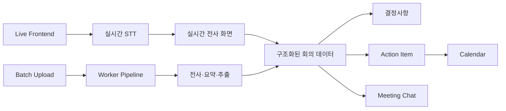
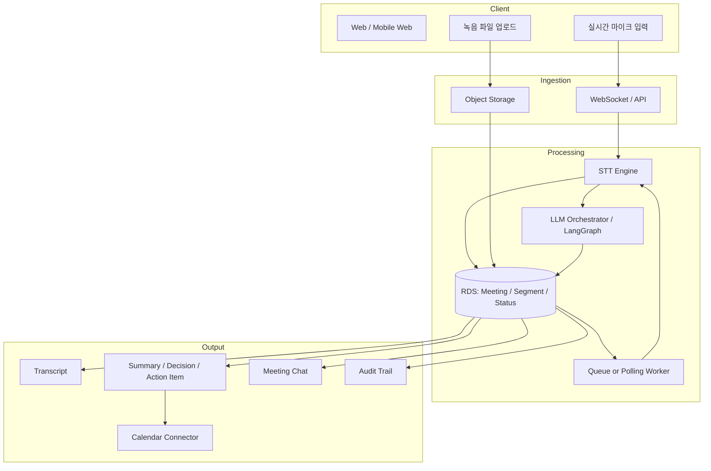

# VoiceDoc Enterprise AI Agent — 발표형 반응형 웹 구현 가이드

> **목적**: PPT처럼 한 장씩 집중해서 설명하되, 웹의 장점인 탭 이동·키보드 이동·상세 정보 확장·데이터 시각화를 활용하는 발표형 랜딩 페이지를 구현한다.
>
> **핵심 메시지**: VoiceDoc은 단순히 음성을 텍스트로 바꾸는 회의록 도구가 아니라, 회의의 `기록 → 결정 → 실행 → 추적 → 재질의`를 하나의 폐쇄형(Closed-loop) 업무 흐름으로 연결하는 엔터프라이즈 AI Agent다.

---

## 1. 구현 목표와 전달 논리

### 발표자가 관객에게 남겨야 하는 결론

1. **명확한 비용 문제**: 회의 후 수기 정리, 확인, 공유, 후속 조치에 시간이 반복적으로 쓰이고 의사결정과 담당자 정보가 흩어진다.
2. **측정 가능한 개선**: AI Agent는 전사·요약만 자동화하는 것이 아니라 결정사항과 액션 아이템을 구조화해 회의 종료 뒤의 업무 시간을 줄인다.
3. **현실적인 도입 가능성**: 시장에는 이미 STT·LLM 기반 회의록 서비스가 있고, 국내 은행도 도입을 시작했다. 따라서 VoiceDoc은 기술 시연이 아닌 실무 적용 가능한 업무 시스템이다.
4. **명확한 차별성**: 실시간 STT와 녹음 파일 일괄 처리, 액션 아이템·캘린더 연동, 회의 맥락 기반 질의응답, 상태 추적과 감사 로그를 결합한다.
5. **안정적인 운영 구조**: 실시간 처리와 대용량 배치 처리를 분리하고, 상태 중심 RDS와 Worker 파이프라인으로 재시도·추적·감사를 보장한다.

### 권장 사용자 흐름

```text
표지
  → 문제와 비용
  → 절감 효과 및 외부 사례
  → 시장 검증·현업 도입성
  → VoiceDoc 차별성
  → Pain Point와 개선 아이디어
  → 데이터·업무 처리 구조
  → KPI/도입 로드맵
  → 결론 및 데모 진입
```

---

## 2. 웹 정보 구조(IA)와 라우팅

### 화면 구성

| 순서 | URL 예시 | 탭 명칭 | 한 줄 메시지 | 발표 목적 |
|---:|---|---|---|---|
| 0 | `/` | Intro | 회의가 끝나도 업무는 끝나지 않는다 | 서비스 정체성 제시 |
| 1 | `/problem` | Why Now | 비구조화된 회의 데이터가 운영 비용을 만든다 | Pain Point 공감 |
| 2 | `/impact` | Business Impact | 작성 시간을 줄이고 실행 누락을 낮춘다 | 시간·비용 효과 설명 |
| 3 | `/market` | Market Proof | 이미 금융권과 엔터프라이즈는 AI 회의록을 도입 중이다 | 도입 현실성 검증 |
| 4 | `/difference` | Why VoiceDoc | 기록을 업무 실행으로 연결하는 Dual Engine | 경쟁력 설명 |
| 5 | `/closed-loop` | Closed-loop | 결정사항과 액션 아이템은 추적되어야 한다 | 혁신성·업무 연결성 강조 |
| 6 | `/architecture` | Architecture | 실시간성과 안정성을 함께 설계했다 | 기술 신뢰 확보 |
| 7 | `/governance` | Trust & KPI | 상태 관리·감사 로그·지표로 운영을 증명한다 | 엔터프라이즈 적합성 |
| 8 | `/roadmap` | Rollout | PoC에서 전사 확산까지 측정 가능하게 도입한다 | 실행 계획 제시 |

### 내비게이션 원칙

- 데스크톱: 상단 고정 탭 + 좌우 이전/다음 버튼 + 페이지 번호(`03 / 09`).
- 모바일: 상단 진행 바 + 현재 탭명 + 하단 `이전`/`다음` 버튼. 탭은 가로 스크롤 또는 Bottom Sheet로 제공.
- 키보드: `←`, `→`, `Space`, `PageUp`, `PageDown` 이동. `Home`은 표지, `End`는 결론.
- 터치: 가로 스와이프를 지원하되, 카드 안의 가로 스크롤·차트 조작과 충돌하지 않도록 이동 임계값을 둔다.
- URL은 화면별로 분리해 발표 중 특정 장면을 바로 공유할 수 있게 한다.
- 애니메이션은 `prefers-reduced-motion` 사용자를 존중하며, 전환 시간은 250~400ms를 넘기지 않는다.

---

## 3. 권장 기술 구조

```text
Frontend
  ├─ Next.js / React + TypeScript
  ├─ Tailwind CSS 또는 CSS Modules
  ├─ Framer Motion (슬라이드 전환)
  ├─ Recharts 또는 ECharts (차트)
  ├─ Mermaid (아키텍처 다이어그램)
  └─ Zustand / Context (현재 슬라이드·데모 상태)

Content Layer
  ├─ content/slides.ts       : 화면별 카피·카드·발표 노트
  ├─ content/metrics.ts      : KPI·외부 사례·차트 데이터
  ├─ content/competitors.ts  : 서비스 비교 표
  └─ content/sources.ts      : 출처·검증일·사용 범위

Backend / Demo API (선택)
  ├─ /api/demo/meeting       : 샘플 회의 생성
  ├─ /api/demo/status        : READY → UPLOADED → TRANSCRIBING → SUMMARIZING → COMPLETED
  ├─ /api/demo/chat          : 회의록 후속 질의 시연
  └─ /api/demo/calendar      : 액션 아이템 캘린더 등록 시연
```

### 권장 폴더 구조

```text
src/
  app/
    page.tsx
    problem/page.tsx
    impact/page.tsx
    market/page.tsx
    difference/page.tsx
    closed-loop/page.tsx
    architecture/page.tsx
    governance/page.tsx
    roadmap/page.tsx
  components/
    SlideShell.tsx
    TopNavigation.tsx
    SlideControls.tsx
    ProgressRail.tsx
    MetricCard.tsx
    SourceDrawer.tsx
    ComparisonMatrix.tsx
    ArchitectureFlow.tsx
    MeetingDemo.tsx
    PresenterNotes.tsx
  content/
    slides.ts
    metrics.ts
    competitors.ts
    sources.ts
  lib/
    slideNavigation.ts
    formatting.ts
```

---

## 4. 공통 UI/UX 가이드

### 레이아웃

- 기본 캔버스는 `min-height: 100dvh`의 한 장형 슬라이드다.
- 콘텐츠 최대 폭은 `1280px`, 좌우 여백은 데스크톱 `48~72px`, 태블릿 `32px`, 모바일 `20px`을 권장한다.
- 큰 제목은 2줄 이내로 제한하고, 긴 설명은 카드·아코디언·발표자 노트로 숨긴다.
- 모든 슬라이드 하단에는 다음 중 하나의 행동을 둔다.
  - `다음: 비용 절감 효과 보기`
  - `시장 검증 확인`
  - `아키텍처 자세히 보기`
  - `데모 시작`

### 시각 언어

- 배경: PPT의 다크 네이비·테크 그리드 분위기를 유지하되, 텍스트 대비를 충분히 확보한다.
- 강조 색: 단 하나의 포인트 색을 사용해 “AI가 만든 변화”와 “핵심 KPI”에만 적용한다.
- 수치: 큰 숫자 + 단위 + 작은 산식/정의의 3단 구성을 사용한다.
- 신뢰: 외부 사례는 `외부 공개 사례`, 내부 수치는 `PoC 가정값` 또는 `실측값` 배지를 붙인다.
- 차트: 색상만으로 데이터를 구분하지 않고, 레이블·패턴·수치도 함께 제공한다.

### 반응형 브레이크포인트

| 구간 | 기준 | 동작 |
|---|---:|---|
| Mobile | `< 768px` | 1열 카드, 비교 표는 카드형 변환, 하단 고정 내비게이션 |
| Tablet | `768~1199px` | 2열 카드, 메뉴 축약, 차트 높이 축소 |
| Desktop | `≥ 1200px` | 12컬럼 그리드, 좌우 도식·설명 병렬 배치 |

---

# 5. 화면별 상세 명세 및 발표 카피

## Slide 0. Intro — VoiceDoc의 정의

### 화면 카피

```text
회의를 기록하는 AI를 넘어,
회의의 결과가 실행되도록 만드는 AI Agent

VoiceDoc Enterprise AI Agent
실시간 전사 · 녹음 파일 일괄 처리 · 결정사항/액션 아이템 · 캘린더 연동 · 회의 맥락 질의응답
```

### 레이아웃

- 좌측: 제목, 한 줄 메시지, `발표 시작` 버튼.
- 우측: 5단계 흐름 애니메이션.

```text
Audio → Transcript → Decision → Action Item → Calendar / Follow-up Chat
```

### 발표 멘트

> “대부분의 회의록 서비스는 회의를 텍스트로 남기는 데서 끝납니다. VoiceDoc은 회의 내용이 실제 담당자의 다음 업무까지 이어지도록 설계한 AI Agent입니다.”

---

## Slide 1. Why Now — 비구조화된 회의가 만드는 비용

### 핵심 메시지

```text
회의의 진짜 비용은 ‘회의 시간’이 아니라,
회의가 끝난 뒤 반복되는 정리·확인·공유·추적에 있다.
```

### Pain Point 카드

| Pain Point | 현업에서 보이는 현상 | 비즈니스 영향 |
|---|---|---|
| 수기 정리 | 녹음 재청취, 발언 정리, 회의록 초안 작성 | 작성 시간이 사람마다 달라짐 |
| 결정사항 분산 | 메신저·메일·개인 노트에 흩어짐 | 재확인과 책임 공방 발생 |
| 후속 조치 누락 | 담당자와 기한이 불명확 | 일정 지연, 업무 누락 |
| 재검색의 어려움 | 과거 회의 속 의사결정을 찾기 어려움 | 동일 논의 반복, 지식 손실 |
| 감사·보안 공백 | 누가 언제 무엇을 수정했는지 불명확 | 규제·내부통제 리스크 |

### 권장 시각화

- 왼쪽: `회의 60분` 타임라인.
- 오른쪽: 후속 업무가 길어지는 “숨은 비용” 퍼널.

```text
회의 60분
  └─ 재청취 / 정리 / 확인 / 공유 / 후속 리마인드
     └─ 사람·조직별 편차가 큰 비표준 프로세스
```

### 발표 멘트

> “문제는 회의 한 시간 자체가 아닙니다. 회의가 끝난 뒤 누군가는 녹음을 다시 듣고, 회의록을 만들고, 의사결정을 확인하고, 담당자에게 다시 물어봐야 합니다. 이 비구조화된 후속 작업이 조직 전체의 운영 비용을 만듭니다.”

---

## Slide 2. Business Impact — 시간과 운영비 절감

### 원칙: 외부 공개 사례와 내부 PoC 수치를 분리한다

#### A. 외부 공개 사례 카드

| 국내 공개 사례 | 공개된 효과·도입 내용 | 웹에서 사용할 해석 |
|---|---:|---|
| **행정안전부 AI 자동회의록 시범 운영** | **1시간 분량 회의 영상·음성 파일을 약 5분 내 보고서 형태 회의록으로 제공**한다고 공개 | 배치 업로드 기반 전사·정리 흐름의 처리 가능성과 시간 절감 근거. 단, 행정안전부의 서비스 처리 기준이지 VoiceDoc 성과가 아님 |
| **NH농협은행 ‘NH AI회의록’** | STT 전사와 LLM 기반 핵심 내용·주요 의사결정 사항 요약, 공유·디지털 자산화를 도입 | 국내 **은행권 실제 도입** 사례로서 금융권 현업 적용 가능성의 핵심 근거 |
| **공공용 네이버웍스·클로바노트 확산** | 공공기관용 협업 환경에 AI 회의록 기능을 통합하고, 행정망 환경·데이터 외부 유출 방지 구조를 강조 | 회의록 AI는 정확도뿐 아니라 **보안·권한·업무 연계**가 도입의 핵심 조건임을 보여주는 국내 시장 근거 |

> **주의**: 행정안전부의 “1시간→약 5분”은 해당 시범 서비스의 처리 시간 안내다. 이를 VoiceDoc의 성능 수치로 사용하지 않는다. 화면에는 `정부 시범 운영`, `국내 금융권 도입`, `공공 보안형 업무환경` 배지를 구분하고, VoiceDoc의 절감 수치는 반드시 내부 PoC 실측값으로 별도 표기한다.

#### B. 내부 PoC 효과 계산기

```text
월 절감 시간 = 월 회의 수 × 회의당 기존 후속 작업 시간 × 자동화 절감률
월 절감 비용 = 월 절감 시간 × 적용 인력의 시간당 총인건비
ROI = (연 절감 비용 - 연간 도입/운영 비용) ÷ 연간 도입/운영 비용
```

#### C. 초기 데모용 가정 데이터 (반드시 “가정값” 배지 표기)

| 지표 | AS-IS | VoiceDoc 적용 후 | 변화 |
|---|---:|---:|---:|
| 회의록 작성·검수 | 120분 | 15분 | -87.5% |
| 결정사항 재확인 | 20분 | 5분 | -75.0% |
| 액션 아이템 배정·공유 | 15분 | 3분 | -80.0% |
| 회의당 후속 작업 | 155분 | 23분 | -85.2% |

### 차트 구현 지시

- **차트 1: 그룹 막대 그래프** — `AS-IS vs VoiceDoc` 회의당 후속 작업 분 단위.
- **차트 2: 누적 막대 그래프** — 작성/검수, 재확인, 배정·공유의 구성 비중.
- **차트 3: KPI 카드** — 월간 회의 수를 사용자가 조절하면 예상 절감 시간·절감 비용이 즉시 변한다.

```ts
export const demoImpact = {
  label: 'PoC 가정값',
  asIsMinutes: { drafting: 120, confirmation: 20, assignment: 15 },
  toBeMinutes: { drafting: 15, confirmation: 5, assignment: 3 },
  monthlyMeetingsDefault: 80,
  hourlyLoadedCostDefault: 45000,
};
```

### 발표 멘트

> “절감 효과는 단순히 전사 속도가 아니라 ‘회의 후속 업무 전체’를 기준으로 봐야 합니다. 행정안전부의 공개 시범 사례는 1시간 분량 파일을 약 5분 내 회의록 형태로 제공할 수 있음을 보여줍니다. VoiceDoc은 이 외부 처리 사례를 참고하되, 회의당 후속 작업 시간을 기준선부터 측정해 실제 도입 효과를 자체 PoC 수치로 검증하겠습니다.”

---

## Slide 3. Market Proof — 실제 현업 도입 가능성

### 핵심 메시지

```text
AI 회의록은 더 이상 실험적인 기능이 아니다.
금융권도 STT와 LLM을 결합해 회의 기록·요약·의사결정 관리에 적용하기 시작했다.
```

### 시장/금융권 사례

| 구분 | 서비스 또는 사례 | 확인 가능한 기능 | VoiceDoc 발표에서의 의미 |
|---|---|---|---|
| 국내 금융권 | **NH농협은행 ‘NH AI회의록’** | STT로 회의 내용을 텍스트로 전환하고 LLM으로 핵심 내용·주요 의사결정 사항을 자동 요약, 공유·디지털 자산화 | 금융권에서도 AI 회의록의 업무 활용이 시작됐다는 현실성 근거 |
| 국내 공공부문 | **행정안전부 AI 자동회의록 시범 운영** | 녹화·녹음 파일 업로드 → 문자 추출 → 참석자·시간순 회의 내용 정리 → 보고서 형태 회의록 제공 | 배치 처리 기반 업무 자동화가 공공 현장까지 적용된 실증 근거 |
| 국내 공공 보안형 협업 | **공공용 네이버웍스·클로바노트** | 발화자 구분·요약·다음 할 일 추천, 행정망 기반 사용과 데이터 외부 유출 방지 구조를 강조 | VoiceDoc의 권한·감사 이력·내부 데이터 처리 설계가 필요한 이유를 설명하는 보안 근거 |

### 도입 현실성 4요소

```text
1. 사용자 경험: 회의 직후 결과를 바로 확인할 수 있어야 한다.
2. 정확성: 회의 유형·용어·참석자 기준으로 검수 가능한 결과를 제공해야 한다.
3. 보안과 통제: 접근권한, 보존정책, 감사 이력이 필요하다.
4. 업무 연결: 액션 아이템이 캘린더·업무 도구로 이어져야 한다.
```

### 화면 설계

- 왼쪽: “시장 기준선” 카드 3개.
- 오른쪽: “금융권이 요구하는 추가 조건” 체크리스트.
- 하단: `현업 도입 가능성 = AI 기능 × 운영 통제 × 업무 연결` 수식형 카피.

### 발표 멘트

> “시장에는 이미 회의 전사와 요약 서비스가 존재하고, 국내 금융권도 STT와 LLM을 결합한 회의록 도입을 시작했습니다. 따라서 핵심은 ‘AI 회의록을 할 수 있느냐’가 아니라, 금융 환경에서 안전하고 지속적으로 운영하면서 실제 업무로 연결할 수 있느냐입니다.”

---

## Slide 4. Why VoiceDoc — 단순 요약을 넘는 차별성

### 핵심 메시지

```text
VoiceDoc의 차별점은 회의록 생성이 아니라,
회의가 발생하는 방식과 회의가 끝난 뒤의 실행을 모두 연결한다는 점이다.
```

### 비교 매트릭스

| 기능 | 일반 회의록 서비스 | VoiceDoc Enterprise AI Agent |
|---|---|---|
| 음성 → 텍스트 | 가능 | 가능 |
| 전체 회의 요약 | 가능 | 가능 |
| 회의 중 실시간 전사 | 서비스별 상이 | **지원** |
| 녹음 파일 일괄 변환 | 서비스별 상이 | **지원** |
| 결정사항·이슈 구조화 | 제한적 | **결정사항/이슈/근거 발화 단위로 구조화** |
| 액션 아이템 | 기본 추출 또는 수동 관리 | **담당자·기한·상태를 추적 가능한 업무 객체로 생성** |
| 캘린더 연동 | 제한적 또는 별도 설정 | **액션 아이템 기반 일정 등록 흐름 제공** |
| 회의록 후속 질의 | 일부 요약 재생성 | **회의 맥락 기반 Chat으로 근거를 포함해 재질의** |
| 엔터프라이즈 운영 | 서비스별 상이 | **RDS 상태관리·Audit Trail·재시도·권한 통제를 설계 목표로 둠** |

### Dual Engine 시각화



### 기대 효과 카드

- **회의 중**: 놓치는 발언을 줄이고, 참여자는 기록 대신 논의에 집중한다.
- **회의 직후**: 정리·공유까지 걸리는 시간을 줄인다.
- **회의 이후**: 담당자·기한·상태를 남겨 실행 누락을 낮춘다.
- **시간이 지난 뒤**: 과거 회의의 근거를 찾아 다시 질문할 수 있다.

### 발표 멘트

> “VoiceDoc은 실시간 회의와 녹음 파일 기반의 사후 회의를 모두 수용합니다. 그리고 회의 결과를 ‘요약문’으로 끝내지 않고, 담당자와 기한이 있는 액션 아이템, 캘린더 일정, 회의 맥락 Chat으로 확장합니다.”

---

## Slide 5. Closed-loop — Pain Point를 업무 실행으로 닫는다

### Pain Point → 해결 아이디어 매핑

| 기존 문제 | VoiceDoc 개선 아이디어 | 사용자에게 보이는 결과 |
|---|---|---|
| 회의 뒤에 다시 녹음을 들어야 함 | Live STT + Batch Upload | 회의 방식과 무관하게 동일한 처리 경험 |
| 회의록은 있는데 할 일이 불명확 | Action Item 추출 | `담당자 / 기한 / 우선순위 / 상태`가 있는 업무 카드 |
| 담당자를 다시 찾고 일정도 따로 등록 | 캘린더 연동 | 업무 생성에서 일정 등록까지 한 흐름 |
| 과거 회의 내용을 다시 찾기 어려움 | Meeting Chat + 근거 발화 연결 | “왜 결정했는가”를 회의 근거로 확인 |
| 처리 상태가 불명확 | 상태 코드·진행률·실패 사유 표기 | 사용자 문의와 운영 대응 감소 |

### 핵심 UI: 액션 아이템 카드 예시

```text
[High] 모바일 앱 푸시 배너 노출 수정
담당자  김OO     기한  2026-07-02     상태  진행 중
근거    “다음 배포 전까지 iOS foreground 배너를 확인하겠습니다.”
행동    [캘린더 등록] [담당자 알림] [회의 근거 보기]
```

### 발표 멘트

> “회의록이 남아도 업무가 실행되지 않으면 생산성 개선은 완성되지 않습니다. VoiceDoc은 회의 데이터를 액션 아이템이라는 업무 객체로 바꾸고, 일정·담당자·상태까지 연결해 회의가 끝난 뒤의 실행 루프를 닫습니다.”

---

## Slide 6. Architecture — 데이터 처리 구조와 안정성

### 핵심 메시지

```text
실시간성은 사용자 경험을 위해,
비동기 Worker는 안정적인 대용량 처리를 위해 분리한다.
```

### 아키텍처 다이어그램



### 처리 상태 모델

| Code | 상태 | 사용자 화면 | 운영 의미 |
|---:|---|---|---|
| 1 | READY / QUEUED | 처리 대기 | Job 생성 완료 |
| 2 | UPLOADED / STREAMING | 업로드 또는 실시간 수집 중 | 입력 수집 중 |
| 3 | TRANSCRIBING | 전사 중 | STT 작업 수행 |
| 4 | SUMMARIZING | 요약·결정사항 분석 중 | LLM 추론 수행 |
| 5 | COMPLETED | 결과 확인 가능 | 모든 산출물 저장 완료 |
| 6 | FAILED | 재시도 또는 문의 | 실패 코드·원인 기록 |

### 설계 포인트

1. **실시간/배치 분리**: 실시간 회의는 낮은 지연 시간, 파일 업로드는 내결함성과 재시도가 중요하다.
2. **상태 중심 데이터 모델**: 화면·Worker·운영자가 동일한 상태를 보고 판단한다.
3. **구조화 추출 우선**: 참석자, 시간, 발화, 결정사항, 액션 아이템, 기한, 담당자처럼 명확한 필드는 관계형 구조로 저장한다.
4. **근거 보존**: 요약·액션 아이템에는 관련 발화 구간과 생성 시각을 연결한다.
5. **실패 복구**: Worker는 idempotency key, 재시도 횟수, 실패 사유, Dead-letter 처리 정책을 갖는다.

### 발표 멘트

> “실시간 전사와 대용량 파일 처리를 하나의 요청 흐름으로 억지로 묶으면 경험과 안정성 모두 나빠질 수 있습니다. VoiceDoc은 사용자에게는 즉시성을 제공하고, 서버에서는 Worker 기반의 비동기 파이프라인으로 재시도와 상태 추적을 보장하도록 분리했습니다.”

---

## Slide 7. Trust & KPI — 엔터프라이즈 운영 가능성

### 핵심 메시지

```text
엔터프라이즈 AI는 ‘잘 요약하는가’뿐 아니라,
누가·언제·무엇을 처리했고 실패 시 어떻게 복구되는가를 증명해야 한다.
```

### 신뢰성 체크리스트

| 영역 | 구현 항목 | 발표 포인트 |
|---|---|---|
| 권한 | 역할 기반 접근 제어, 회의 단위 접근권한 | 민감한 회의록의 열람 범위 통제 |
| 보존 | 원본 파일·전사본·요약본 보존기간 분리 | 데이터 최소 보존 및 정책 대응 |
| 감사 | 조회·다운로드·수정·재처리 이력 | 내부통제와 운영 추적성 |
| 품질 | STT 오류 신고, 요약 수정, 피드백 수집 | 지속적인 품질 개선 근거 |
| 안정성 | 상태값, 재시도, 실패 사유, 모니터링 | 운영자가 문제를 재현·복구 가능 |
| 책임성 | 생성 결과의 근거 발화 링크 | AI 결과를 검증 가능한 업무 산출물로 전환 |

### KPI 대시보드

```text
Adoption
- 주간 활성 사용자(WAU)
- 회의 생성 수 / 실시간 : 배치 비율

Efficiency
- 회의당 후속 작업 시간
- 자동 생성 후 수정 소요 시간
- 캘린더 등록 전환율

Quality
- 전사 수정률
- 액션 아이템 승인율
- 회의록 재질의 만족도

Reliability
- 처리 성공률
- P95 처리 시간
- 재시도 후 성공률
- 실패 원인 Top 5
```

### 발표 멘트

> “엔터프라이즈 환경에서는 요약 품질만으로 충분하지 않습니다. 누가 어떤 회의록을 열람했고, 어떤 작업이 실패했는지, 액션 아이템이 실제 일정으로 전환됐는지를 측정해야 서비스가 운영 시스템이 됩니다.”

---

## Slide 8. Rollout — PoC에서 전사 확산까지

### 3단계 도입 로드맵

| 단계 | 기간 예시 | 적용 범위 | 검증 기준 |
|---|---|---|---|
| 1. PoC | 4~6주 | 회의가 잦은 1~2개 조직 | 회의당 후속 시간, 정확성, 사용자 만족도 |
| 2. Pilot | 2~3개월 | 유관 부서 확대, 캘린더 연동 | 액션 아이템 전환율, 운영 안정성, 보안 검토 |
| 3. Scale | 분기 단위 | 전사 또는 핵심 업무군 | 절감 비용, 준수율, 표준 업무 프로세스 정착 |

### PoC 성공 기준 예시

```text
- 회의당 후속 작업 시간: 기준선 대비 50% 이상 단축
- 생성 회의록 수정 완료율: 80% 이상
- 액션 아이템 추출 후 승인율: 75% 이상
- 처리 성공률: 99% 이상
- 사용자 만족도: 5점 척도 평균 4.0 이상
```

> 위 목표는 예시다. 실제 기준선(Baseline)을 1~2주 측정한 뒤 조직 특성에 맞게 재설정한다.

### 최종 결론 카피

```text
VoiceDoc은 회의를 자동 기록하는 서비스가 아니라,
회의의 결정을 실행 가능한 업무로 바꾸고
그 결과를 다시 조직의 지식과 운영 지표로 축적하는 AI Agent다.
```

---

# 6. 차트·표 데이터 설계

## 6.1 외부 사례 데이터

```ts
export const externalCases = [
  {
    organization: 'Ministry of the Interior and Safety',
    vendor: 'AI Automatic Meeting Minutes Pilot',
    metric: 'processing_time',
    inputDurationMinutes: 60,
    outputDurationMinutes: 5,
    unit: 'minutes',
    label: '1시간 분량 회의 영상·음성 파일을 약 5분 내 보고서 형태 회의록으로 제공',
    evidenceType: 'government_pilot',
    caveat: '행정안전부가 공개한 시범 서비스 처리 시간. VoiceDoc의 성능 수치가 아님.',
  },
  {
    organization: 'NH NongHyup Bank',
    vendor: 'NH AI Meeting Minutes',
    metric: 'adoption',
    value: null,
    unit: 'n/a',
    label: 'STT·LLM 기반 회의 전사·핵심 내용·의사결정 요약 및 공유·디지털 자산화 도입',
    evidenceType: 'domestic_financial_adoption',
    caveat: '정량 절감 수치를 공개한 사례가 아니므로 시장 검증 슬라이드에서만 사용.',
  },
  {
    organization: 'Public-sector Naver Works',
    vendor: 'CLOVA Note',
    metric: 'secure_adoption',
    value: null,
    unit: 'n/a',
    label: '공공기관용 협업 환경에 AI 회의록 기능을 통합하고 행정망 기반 보안형 사용을 제시',
    evidenceType: 'domestic_public_secure_workflow',
    caveat: '기사 내 솔루션·사업자 설명을 포함한 시장 사례. VoiceDoc의 보안성 검증 결과가 아님.',
  },
];
```

## 6.2 내부 실측 데이터 스키마

```ts
export type MeetingEfficiencyMetric = {
  meetingId: string;
  meetingType: 'live' | 'batch';
  baselineFollowupMinutes: number;
  aiDraftMinutes: number;
  humanReviewMinutes: number;
  finalFollowupMinutes: number;
  actionItemsExtracted: number;
  actionItemsApproved: number;
  calendarLinkedCount: number;
  transcriptionEditRate: number;
  createdAt: string;
};
```

## 6.3 차트 UX 규칙

- 외부 사례·내부 실측값·가정값을 한 그래프에 섞지 않는다.
- 차트 제목에 **측정 단위**와 **기간**을 쓴다.
- 비용은 원화와 산식을 같이 보이고, 인건비 단가는 환경설정 또는 별도 주석으로 분리한다.
- “90% 절감” 같은 단일 숫자를 메인 카피로 쓸 때는 반드시 `측정 범위`, `모수`, `기간`, `기준선`을 Source Drawer에서 확인할 수 있게 한다.

---

# 7. 발표 모드 기능

## Presenter Mode (`?presenter=1`)

- 화면 오른쪽에 다음 슬라이드 미리보기.
- 현재 슬라이드별 발표 스크립트, 예상 소요시간, 핵심 질문 표시.
- `S` 키: 발표자 모드 On/Off.
- `B` 키: 화면 블랙아웃.
- `D` 키: 데모 데이터 리셋.
- 각 슬라이드별 30초·60초·120초 버전 스크립트 제공.

## Source Drawer

- 우측 하단 `출처 및 산식` 버튼.
- 외부 사례: 출처 제목, 발행일, 확인일, 인용 범위, “VoiceDoc 성과가 아님” 고지.
- 내부 수치: 데이터 기간, 회의 수, 제외 조건, 계산식, 담당 부서.
- 발표 모드에서는 기본적으로 닫혀 있고 질의응답 때만 연다.

---

# 8. 접근성·보안·품질 체크리스트

## 접근성

- 모든 차트에 텍스트 요약과 데이터 테이블을 제공한다.
- 색상 대비는 WCAG AA 이상을 목표로 한다.
- 슬라이드 전환은 포커스를 새 화면의 제목으로 이동한다.
- 아이콘 버튼에는 `aria-label`을 제공한다.
- 자동 재생 애니메이션은 정지 가능해야 한다.

## 보안

- 데모 페이지에 실제 회의 녹음·개인정보·고객정보를 넣지 않는다.
- 실서비스 연동 전에는 파일 암호화, 접근권한, 보존기간, 감사로그 요구사항을 별도 체크한다.
- LLM 요청 데이터의 마스킹/비식별화 정책과 외부 전송 여부를 명확히 한다.

## 발표 품질

- 수치에는 항상 `외부 사례`, `내부 실측`, `가정값` 중 하나를 명시한다.
- 경쟁사 비교는 “기능 제공 여부가 서비스 플랜·설정에 따라 달라질 수 있음”을 각주로 둔다.
- 기술 설명은 `왜 이 구조인가 → 무엇이 좋아지는가 → 어떻게 검증하는가` 순으로 끝낸다.

---

# 9. 개발 우선순위

## MVP (발표용 1차)

1. 9개 슬라이드 라우트와 다음/이전 전환.
2. 표지, Pain Point, 차별화 표, 아키텍처, KPI 화면.
3. 외부 사례 3개와 내부 가정값 차트.
4. Presenter Mode와 Source Drawer.
5. 모바일 대응 및 키보드 내비게이션.

## 2차 고도화

1. 회의 업로드 → 상태 변화 → 결과 생성의 인터랙티브 데모.
2. 액션 아이템에서 캘린더 등록으로 이어지는 모의 플로우.
3. 회의 맥락 Chat 데모.
4. 실제 PoC 결과를 KPI 대시보드에 연결.
5. 역할별 권한·감사 로그 화면을 관리 콘솔 형태로 확장.

---

# 10. 국내 공개 근거 및 참고기사

> 발표에서는 **국내 기관·국내 시장 근거**만 효율성·현업성 슬라이드에 사용한다. 외부 기관의 수치는 VoiceDoc의 성과가 아니므로, 각 카드 하단에 출처·발행일·적용 범위를 표기한다.

1. **행정안전부, AI 자동회의록 시범 운영** — 회의 영상·음성 파일을 업로드하면 문자 추출 후 참석자·시간순 회의 내용으로 정리하고, **1시간 분량 파일을 보고서 형태로 제공하는 데 약 5분**이 걸린다고 안내. 배치 업로드 기반 처리의 정량 근거로 사용한다.
   - 행정안전부 보도자료, 2024-03-21: https://www.mois.go.kr/frt/bbs/type010/commonSelectBoardArticle.do?bbsId=BBSMSTR_000000000008&nttId=107994
   - 연합뉴스 보도, 2024-03-21: https://www.yna.co.kr/view/AKR20240321069000530

2. **NH농협은행, ‘NH AI회의록’ 도입** — 은행권 최초로 STT와 LLM을 결합해 회의 텍스트 변환, 핵심 내용·주요 의사결정 사항 자동 요약, 공유·디지털 자산화를 추진. **금융권 실제 도입 가능성**을 설명하는 대표 근거로 사용한다.
   - 연합뉴스, 2026-05-04: https://www.yna.co.kr/view/AKR20260504077300002

3. **공공용 네이버웍스·클로바노트** — 공공기관용 협업 플랫폼에 AI 회의록 관리 기능을 탑재하고, 발화자 구분·요약·다음 할 일 추천과 행정망 기반 보안형 사용을 제시. **보안·권한·업무 연계가 도입 요건**이라는 논리를 뒷받침하는 국내 시장 자료로 사용한다.
   - 전자신문, 2025-12-17: https://www.etnews.com/20251217000043

4. **국내 기업용 AI 회의록 시장 확산** — 네이버웍스 클로바노트의 유료 고객 수가 2024년 10월 출시 후 2025년 12월까지 월평균 40% 이상 증가했다는 업계 보도. 개별 성능 수치가 아닌, **기업용 AI 회의록의 국내 수요와 시장성**을 설명하는 보조 근거로 사용한다.
   - 연합뉴스, 2026-03-31: https://www.yna.co.kr/view/AKR20260330164600017

### 슬라이드별 권장 배치

- **Slide 2 — 시간·비용 절감**: 행정안전부 `1시간 파일 → 약 5분` 카드 1개만 사용. “정부 시범 서비스 처리 기준, VoiceDoc 성과 아님” 배지 고정.
- **Slide 3 — 현업 도입 가능성**: NH농협은행 카드와 공공용 네이버웍스·클로바노트 카드를 나란히 배치. 금융권·공공부문 모두 도입 조건이 `업무 연계 + 보안`으로 확장된다는 점을 연결.
- **Slide 4 — 차별화**: 위 국내 사례가 제공하는 전사·요약·공유를 기준선으로 두고, VoiceDoc의 `실시간 STT + 배치 업로드 + 액션 아이템 + 캘린더 연동 + 회의 맥락 Chat + 감사 이력`을 추가 가치로 제시.

### 발표 시 피해야 할 표현

- “행정안전부 수준으로 5분 만에 처리합니다.” → **금지**. 외부 서비스의 처리 시간이다.
- “농협은행보다 더 정확합니다.” → **금지**. 비교 검증 데이터가 없으면 기능 범위 비교로 한정한다.
- “국내 기업들이 이미 절감 효과를 입증했습니다.” → **수정 필요**. “국내 금융권·공공부문에서 도입과 시범 운영이 진행되고 있다”로 표현한다.

---

# 11. PPT 반영 사항

이 문서는 제공된 VoiceDoc 발표 자료의 다음 핵심 콘셉트를 웹 발표 흐름으로 재구성했다.

- 비구조화된 회의 데이터가 만드는 시간·운영 비용 문제
- 단순 회의록 서비스와 업무 실행 Agent의 차이
- 실시간 STT와 Worker 기반 배치 처리의 Dual Engine
- RDS 상태 관리, 구조화된 컨텍스트, LangGraph 기반 추론
- 회의록 Chat, 액션 아이템, 캘린더 연동
- 처리 상태·감사 이력·엔터프라이즈 운영 안정성
- 시간 중심의 업무 비용 절감과 단계적 PoC 확산
